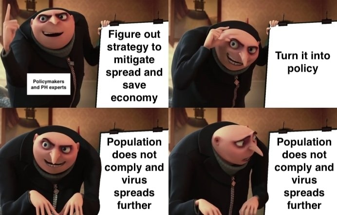
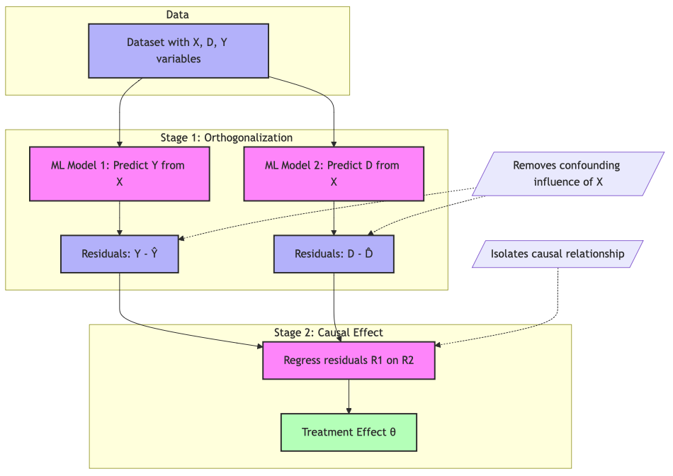

# Introduction

## Relevance: Informing better policy making

<!-- ::: columns
::: {.column width="38%"}




:::

::: {.column width="4%"}
:::

::: {.column width="58%"}

- Need to understand which drivers are strongest predictors
- Need to understand how drivers intersect
- Identifying the causal pathways in compliance 
  - helps avoid unintended policy consequences 
  - enables faster and more promising decision making during crises.

:::
::: -->


- Identifying the causal pathways in compliance 
  - helps avoid unintended policy consequences, 
  - enables faster and more promising decision making during crises.

::: {.notes}
We know: Next pandemic will come (WHO, etc says it)
:::


## Relevance: Compliance drives policy success


- COVID-19 exposed complex challenges in public health compliance, `especially in LMIC`.
- A better understanding of behavioral drivers is critical to design effective, context-specific public health interventions.

::: {.notes}
LMIC: Enforcement difficult
Tracking difficult
Gov communication difficult
More resource constrained
:::


## This thesis {background="#43464B"}


### What drives compliance with public health measures during pandemics in LMICs?


# Literature Review

## Literature Search Strategy
::: columns
::: {.column width="38%"}
- Searched Pubmed, WOS, Scopus
- Added sources through snowballing
- 354 studies reviewed
:::
::: {.column width="4%"}
:::
::: {.column width="58%"}

:::
:::

## Risk Perception and Information Ecosystem

- Risk perceptions predict compliance [@bazrafshanHealthRiskCommunication2023; @zucolotoPanoramaCOVID19Risk2022]
- Reliable knowledge increased early adoption; misinformation undermined compliance [@ferreiracaceresImpactMisinformationCOVID192022]
- Trust in institutions [@heAssociationPublicTrust2022] & information sources [@mohammedPerceivedBarriersFacilitators2021] mediate knowledge-perception relationship

## Socioeconomic Constraints and Trade-offs

- Individuals choose between economic survival and health protection
- Lower-income groups faced compliance-limiting economic constraints [@stevensExperiencesSociallyVulnerable2021]
- Financial constraints led to prioritizing income over compliance [@miftodeInfluenceSocioeconomicStatus2021; @xiongInteractingParticleModels2024]
- This life-livelihood trade-off should be more critical in LMIC with higher economic vulnerability

## Social Dynamics and Cultural Contexts I

**Social Networks & Identity**

- Social networks and influencers promote precaution adoption [@ermanExploringEffectCollective2021; @makridisHowSocialCapital2021]
- Group identity reinforces compliance [@savilleCovidCommonGood2024]

**Cultural Values**

- Collectivist societies showed higher compliance than individualistic ones [@gelfandRelationshipCulturalTightness2021]
  - Tight-knit communities increase adherence [@ibid]
- High power-distance cultures accepted top-down mandates [@alvarez-galvezImpactGovernmentActions2023]
- Cultural tightness enforced uniform adherence [@nevilleSocialNormsSocial2021]

## Social Dynamics and Cultural Contexts II


**Identity Politics**

- Partisan identities can override other factors [@nairCultureCOVID19Impact2022]
- Religious freedom cited to resist restrictions [@filsingerAsymmetricAffectivePolarization2024]
- Political identity affects compliance [@govindSellingHopeHate2024; @filsingerAsymmetricAffectivePolarization2024]

## Institutional and Demographic Factors

**Institutions**

- Institutional setup affects compliance [@keshetFearPanopticSurveillance2020]
- Measure strictness influences adherence [@guimaraesEffectPhysicalDistancing2021]

**Demographics** 

- Demographics (gender [@zucolotoPanoramaCOVID19Risk2022], age [@zuInvestigatingRelationshipReopening2021]) predict compliance
  - But demographics correlate with risk perception and attitudes


# Gaps in the Literature

## Three Critical Research Gaps

**1. Health Income Trade-off**

- Critical **interaction** assumed but not causally confirmed & quantified
- Some vaccine WTP studies [@catmaWillingnessPayHypothetical2021] but lacking for protective behaviors

**2. Social Influence**

- True peer effects vs self-selection into groups remains unclear
- Emerging evidence from influenza studies shows *pure* peer effects [@miyazatoPeerEffectsInfluenza2024b]

**3. Interactive Factors**

- Factors typically studied in isolation, not as interacting elements
  - Exceptions mostly in HICs (Health Belief Model [@badrOvercomingCOVID19Vaccine2021], Theory of Planned Behavior [@wollastTheoryPlannedBehavior2021])
  - No multi-country or longitudinal studies


## Research framework

| Chapter | Research question  | Contribution                                                  |
|----------|--------------------------------------------------------|
| `1`    | What was the relative importance of economic constraints and health risk perceptions on compliance with NPI during COVID-19 in Malawi                                                     |
| `2`   | What was the causal effect of peer groups on COVID-19 vaccination intentions in Ethiopia                                                |
| `3`| What are the direct and interacted effects of various behavioral determinants on compliance with public health measures                               |

::: {.notes}
C1 & C2: Both NPI and vaccines
C3: NPI
:::


# Chapter I: Quantifying the health income trade-off assumption
RQ: What was the relative importance of economic constraints and health risk perceptions on compliance with NPI during COVID-19 in Malawi

## Background & Gaps
### Widely assumed trade-off between income and health that individuals face
- Rationale behind cash transfer programs
- Supported by economic theory [e.g. @grossmanConceptHealthCapital1972]; Prospect Theory
- Empirical evidence shows
  - Effects of income [e.g. @stevensExperiencesSociallyVulnerable2021]
  - Effects of risk perceptions [e.g. @bazrafshanHealthRiskCommunication2023]
- Income and risk perception never modeled together to confirm **trade-off** in causal way

## Hypotheses

### H1: Economic vulnerability predicts compliance
### H2: Health risk perceptions predict compliance
### H3: Individuals face a trade-off between preserving their health and their economic security

## Data
### World Bank Malawi high frequency phone survey between 2020 and 2024
- Subset: 05/20-07/21 (13 Rounds)
- Nationally representative sample of households based on the Malawi National Integrated Household Panel Survey from 2019
- 1729 participants at baseline & 8% attrition at R13
- Further weighting based on census data

## Methods: Double Debiased Machine Learning

::: columns

::: {.column width="4%"}
:::

::: {.column width="28%"}

- Traditional econometric approaches challenging with rich controls due to complex functional forms (e.g., collinearity, non-linearity, etc.) [@belloniProgramEvaluationCausal2017]

- Machine Learning can handle complex functional forms and data patterns. **But** delineating different factor's distinct influence is challenging.

:::

::: {.column width="68%"}




:::

:::


## Methods: Double Debiased Machine Learning I

- Traditional econometric approaches require trade-off
    - Including limited confounding information -> endogeneity concerns
    - Including a lot of controls -> modeling challenges due to complex functional forms (e.g., collinearity, non-linearity, etc.) [@belloniProgramEvaluationCausal2017]

 
- Machine Learning can handle complex functional forms and data patterns
  - E.g., many non-linear controls, collinearity for predicting outcomes.
  - **But** delineating different factor's distinct influence is challenging.
    - Estimates difficult to interpret due to (often) non-traceable data transformations.


## Methods: Double Debiased Machine Learning II


## Expected Contributions
### Empirical contribution
- First causal investigation into health income trade-off in context of protective measures during a pandemic
- Quantification of trade-off and comparison over time

### Theoretical Contribution
- Empirical test of widely-assumed trade-off assumption

### Policy relevance
- Informs more efficient data collections during early phases of emergencies
- Informs resource allocation efficiency


# Chapter II: The role of peer effects on vaccination intentions
RQ: What was the causal effect of peer groups on COVID-19 vaccination intentions in Ethiopia

## Background & Gaps

- Peer effect = effect of membership in group
- BUT: Self-selection into group raises question of mechanism of effects
  - Did my peers influence my decision
  - Or do my values, etc. drive my decision and I choose peers with similar values, etc
- Important implications for policy design: Target communication, etc better and save resources

## Data
### World Bank Ethiopia high frequency phone survey between 2020 and 2024
- Household panel data. Subset: 05/20-00/23 
- Measures vaccine intentions
- Nationally representative sample of households
- Multiple respondents per household 
- Survey experiment at R14: vaccine priming


## Methods

- Lagged outcome control design
  - **Explain vaccine intention based on previous intentions/vaccination status of household members**
- Exploit experimental manipulation at R14
  - Is the rate of vaccine intentions different between peers of respondents that received priming and those that did not


## Expected Contributions

### Empirical contribution

- First longitudinal analytical investigation of peer effects vs self-selection during COVID-19 in LMIC

### Theoretical Contribution

- Highlight role of peer effects vs self-selection in pandemic settings

### Policy relevance

- Inform better targeting of communication campaigns, etc

# Chapter III: Informing a theory of pandemic behavior

RQ: What are the direct and interacted effects of various behavioral determinants on compliance with public health measures

## Background & Gaps I

### Different factors interact and shape behavior **together**

- Some studies use theoretical frameworks (Health Belief Model `OR` Theory of Planned Behavior) to analyze survey data
- Only [@buiUtilizingTheoryPlanned2023] in LMIC (Looking at students in Vietnam)
- No paper integrating/extending these in COVID-19 in LMIC
- No study comparing different geographical contexts
- No comparison of NPI and vaccines

## Frameworks


## Data

### MIT C19 preventative health survey
- Conducted via online surveys distributed to Facebook users globally
- Over 100k observations across 78 countries
- Weighted to account for probability of being FB user
- Contains data on all aforementioned factors
- Repeated cross-sectional survey
- Requested & granted. Currently correspondence between LSE Data Library and MIT

## Methods
- Structural equation modeling to uncover latent and observed pathways
  - Explicitly models causal pathways and feedback loops
  - Allows simultaneous estimation of direct and indirect effects in predicting preventive behavior
  - Conduct at different waves for robustness checks and comparison  

## Methods


Example of a structural equation model


::: notes
GLM: small sample but requires normal distributions
GLS: needs large sample but more flexible to distributions
Bayes: requires priors
:::


## Expected Contributions
### Empirical contribution
- First large scale SEM across countries and waves
- Quantification of uncertainty and relative importance of factors

### Theoretical Contribution
- Informing more comprehensive framework of pandemic behavior
- Introducing nuance around different intervention types (NPI vs vaccine)

### Policy relevance
- Informs more efficient data collections during early phases of emergencies
- Informs resource allocation efficiency


# Thank you

# Questions & Feedback

# Open questions

## Some things to consider

#### Health Income Trade-off
- Compare at different survey waves
- Measure Exposure variables as binary or continuous

#### Peer effects
- Focus on R14 (experiment) for more robust causal case
- Too many other dynamics within family (e.g. gender) to identify peer effects
- Can I elicit mechanisms of peer effects

#### Interactions of factors
- Compare countries Waves Outcomes
- Focus on one case Arbitrary

## Annex: Literature search strategy II: Search string

```{.python}
TITLE-ABS-KEY(
  (pandemic* OR epidemic* OR outbreak* OR "public health crisis*")
  AND
  (behavio*r OR compliance OR adherence OR "preventiv* measures" OR "protective measures" OR mitigation OR "health response*" 
    OR lockdown* OR "stay at home" OR "social distan*" OR quarantine OR "mask* use" OR "mask wearing" OR hygiene OR "hand wash*" 
    OR "vaccine acceptance" OR "vaccination intent*" OR "testing uptake" OR "contact tracing" OR "physical distancing" OR "non-pharmaceutical intervention*")
)
AND
TITLE-ABS-KEY(
  (determinant* OR predictor* OR factor* OR driver* OR influenc*)
  AND
  (economic OR "socio-cultural" OR social OR institutional OR psychological OR "risk perception*" OR cognitive OR affective OR normative 
    OR "peer effect*" OR "media influence*" OR politic* OR demographic* OR cultural OR structural OR contextual)
)
```

## Annex Gaps I 

### Peer group effects vs self-selection
- Unclear whether group/network effects are driven by self-selection into groups
- Some descriptive insights from self-reported reasons for behavior
- Evidence from influenza suggests *pure* peer effects in vaccination behavior [@miyazatoPeerEffectsInfluenza2024b]


## Annex Gaps II

### **Is** there a health vs income trade-off
- Trade-off widely assumed but never causally confirmed and quantified
  - Influence of economic status & health risk perception confirmed separately
  - Most studies on role of economic status done in HICs
  - Not yet modeled together and isolated from other factors that might *override* trade-off
  - Some WTP insights for vaccines [e.g. @catmaWillingnessPayHypothetical2021], but no quantification of impact of health risk perceptions **relative to economic vulnerability** and vice versa on NPI behavior


## Annex Gaps III


### Dynamic interactions
- Factors mostly modeled in isolation
- Crucial interactions sometimes assumed but never causally traced
  - E.g., interaction of risk perceptions vs economic vulnerability
- Limited application of holistic frameworks in HICs
  - E.g., Health belief model in USA [@badrOvercomingCOVID19Vaccine2021], Theory of planned behavior in France [@wollastTheoryPlannedBehavior2021]
  - One study among students in Vietnam [@buiUtilizingTheoryPlanned2023]
  - Exclusively single country, single time-period studies


# Annex: Chapter I

## Annex: Structural Equation Modeling II (Skip)

### Confirmatory Factor Analysis (CFA) 
- To validate latent constructs
- To operationalize constructs from survey items

### Comparative Model Evaluation
- Predictive power assessment (variance explained in preventative behavior)
- Multi-group SEM for cross-country/SES/gender comparisons
- Akaike Information Criterion (AIC) & Bayesian Information Criterion (BIC) for model comparison

# Annex II Chapter 2


## Annex: Chapter II BG: Malawi during waves 1 & 2 of C19


## Annex: Chapter II How: Outcomes
| `Outcome`              | Indicators                                        | Investigation at  | Hypothesis tests  |
|----------------------|------------------------------------------------|------------------|------------------|
| **`Social distancing`** | Gathering attendance; non-essential travels; Reduced Shopping | Multiple rounds  | H1, H2, H3       |
| **`Hygiene & Mask`**    | Hand Washing; Mask Wearing                     | Single Round    | H2               |
| **`Willingness to test`*** | Willingness to test                          | Single Round    | H1               |
| **`Vaccine Acceptance*`** | Willingness to vaccinate                      | Single round    | H1               |

*Vaccines and tests are provided for free but involve significant transaction and opportunity costs. Reddy, K.P., Fitzmaurice, K.P., Scott, J.A. et al. Clinical outcomes and cost-effectiveness of COVID-19 vaccination in South Africa. Nat Commun 12, 6238 (2021)

## Annex: Chapter II How: Treatments I

### Economic Vulnerability Indicator
- Constructed from factors such as:
	- Current income
	- Self-reported economic stability perception
	- Economic risk perception due to the pandemic
	- Main income source (formal vs informal economy)
	- Consumption quantile (based on monthly spending)
- Operationalization methods under consideration:
  - Inverse Probability Weighting (IPW) by Anderson
  - Established economic vulnerability measures (e.g., Calvo & Dercon, 2005)
  - Data-driven approach (PCA or single factor analysis)

## Annex: Chapter II How: Treatments II

### Health Risk Perception Indicator
- Self-reported health risk perception
- Infection history and self-reported comorbidities
- Recent COVID-19 symptoms

### Trade-off as interaction term

## Annex: Chapter II How: Controlling for
- Demographics (Age, gender, education, urban/rural, etc)
- Cultural affiliations and beliefs (religion, parties, norms, etc)
- HH characteristics (size, adult equiv, etc)
- Exposure to C19
- Trust in institutions & conspiracy beliefs
- Mental health
- Macro context (policies, economic performance, etc)
- And some more (self-efficacy, C19 communication exposure, news consumption, etc)


## Annex: Chapter II How: Challenges of traditional econometric approaches I


## Annex: Chapter II How: Challenges of traditional econometric approaches II
### Strengths
- Interpretability
- Causal pathway identification

### Limitations
- Exogeneity concerns
  - Either RCT or
  - Quasi experimental approach difficult with income
  - Controlling requires many functional assumptions

## Annex: Chapter II How: Challenges of machine learning
### Strengths
- Very flexible re functional forms
- Can handle large amounts of covariates

### Limitations
- Overfitting concerns
- Causal pathway interpretation challenging


## Annex: Chapter II How: Double Debiased Machine Learning II
### Cross-fitting to reduce overfitting and regularization bias


# Annex III Chapter 3

<!-- ## Peers, Social Cohesion & Norms I

#### Peer Influence and Group Identity

- Individuals are more likely to adopt precautions (mask-wearing, distancing) when their immediate social networks and local influencers model these behaviors [@ermanExploringEffectCollective2021; @makridisHowSocialCapital2021]. 
- Group identity reinforces compliance when health behaviors are seen as a mark of belonging [e.g. @gelfandRelationshipCulturalTightness2021].

#### Community Trust & Norms
- Tight-knit communities facilitate adherence to health measures [@gelfandRelationshipCulturalTightness2021].
- Partisan identities and in-group norms can override other favtors, leading to selective compliance or even counter-normative behavior [@nairCultureCOVID19Impact2022].

## Peers, Social Cohesion & Norms II

#### Individualism vs. Collectivism

- Collectivist societies (e.g., many East Asian countries) achieved higher compliance by emphasizing group welfare, while individualistic cultures (e.g., the US, UK) often resisted restrictions [@gelfandRelationshipCulturalTightness2021].

#### Hierarchy and Norm Enforcement

- High power-distance cultures readily accepted top-down mandates [@alvarez-galvezImpactGovernmentActions2023]
- Societies characterized by cultural tightness enforced uniform adherence through strict norms [@nevilleSocialNormsSocial2021; @gelfandRelationshipCulturalTightness2021].
- Some resisted restrictions citing religious freedom [@filsingerAsymmetricAffectivePolarization2024].

## Health risk perceptions, knowledge & trust

- `Risk perceptions shape compliance intentions`
  - Risk perceptions predict compliance [@bazrafshanHealthRiskCommunication2023; @zucolotoPanoramaCOVID19Risk2022].
- `Knowledge influences risk percetions`
  - Reliable knowledge from public health sources spurred early adoption of measures, whereas misinformation (*infodemic*) undermined compliance [@ferreiracaceresImpactMisinformationCOVID192022].
  - Trust in institutions [@heAssociationPublicTrust2022] & information source consumption [@mohammedPerceivedBarriersFacilitators2021] mediate relationship between knowledge and perception.


## Trade-offs between life and livelihood
- `Economic Imperatives vs. Health Preservation`
  - Individuals must often choose between immediate economic survival (working despite risks) and protecting their health by complying with mitigation measures.
  - Lower-income groups often faced economic constraints that reduced their ability to comply [@stevensExperiencesSociallyVulnerable2021].
  - Studies show that financially constrained individuals are more likely to forgo compliance measures in favor of income security [@miftodeInfluenceSocioeconomicStatus2021; @xiongInteractingParticleModels2024].
- If true, in LMICs, where economic vulnerability is pronounced, the trade-off between life (health) and livelihood becomes even more critical

## Institutional context, partisanship, and other factors

- Among others, [@keshetFearPanopticSurveillance2020] shows effect of institutionl setup, rigidity, and acceptance.
- Strictness of the measure itself also relevant [@guimaraesEffectPhysicalDistancing2021]
- In highly political contexts, partisanship can override other factors [see e.g. @govindSellingHopeHate2024; @filsingerAsymmetricAffectivePolarization2024].
- Demographic factors sometimes also predictors. E.g. gender [see @zucolotoPanoramaCOVID19Risk2022]; Age [@zuInvestigatingRelationshipReopening2021]
  - But highly correlated with other factors (like risk perception, attitudes, etc.) -->

