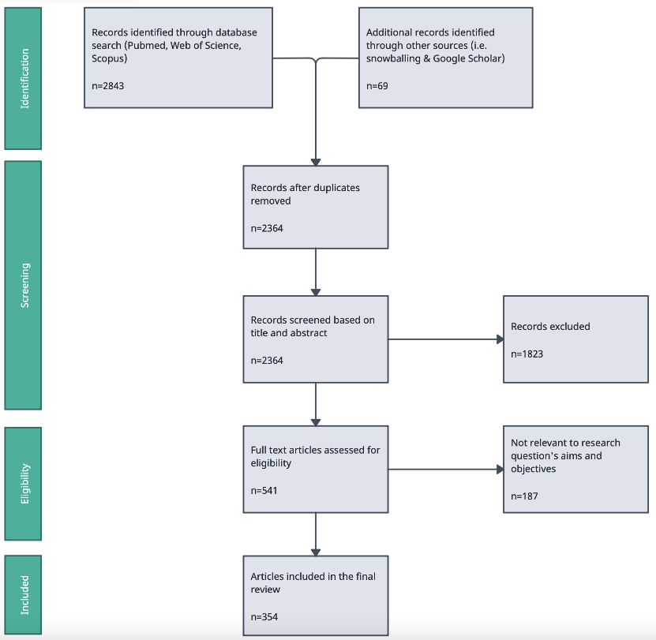
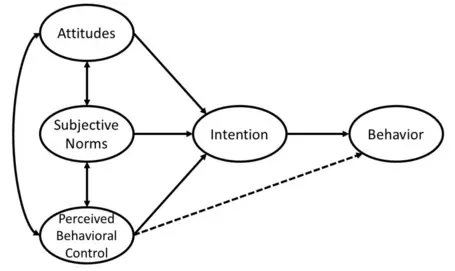
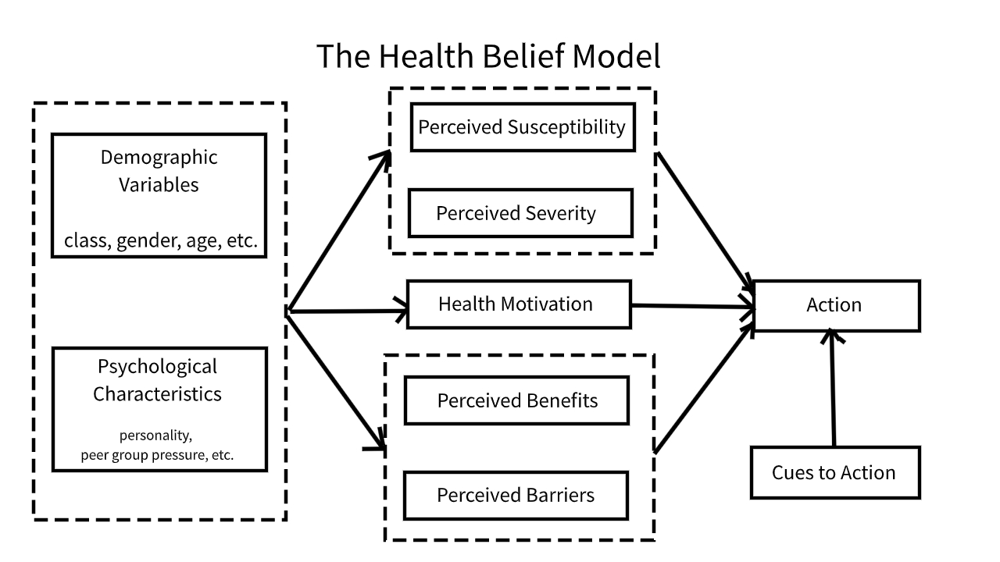
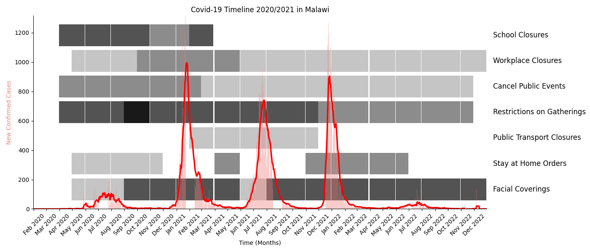
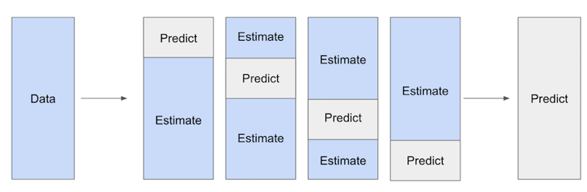

# Introduction

---

## Research Question {background="#43464B"}

---

### How do `dynamic interactions` among diverse behavioural determinants shape public health `compliance` during infectious disease outbreaks in LMICs?

--- 

## Relevance: Global & Policy Relevance
### Pandemic Impact  in LMICs

- COVID-19 exposed complex challenges in public health compliance, `especially in low- and middle-income countries`.
- LMICs face unique socio-economic and institutional hurdles not fully captured by HIC-focused research.
- A better understanding of behavioural drivers is critical to design effective, context-specific public health interventions.

--- 

## Relevance: Enabling better policy making

### Predicting policy sucess instead of only ex-post evaluations


- Policymakers require robust, causal evidence to balance health protection with economic stability.
- Identifying the causal pathways in compliance 
  - helps avoid unintended policy consequences 
  - enables faster and more promising decision making during crises.


> Is there another pandemic coming? Yes. When? Which pathogen? How severe will it be? No one can say for sure. 

Yonatan Grad, `Harvard T.H. Chan School of Public Health`


<!-- ## Why {background="#43464B"}


### C19 produced **`a lot`** of research into pandemic behaviours and their determinants


### But there is a substantive `lack of insights` into
  - How these relate to and interact with each other
  - Differentiation between NPI & vaccines
  - LMIC specific dynamics
  - Causal links esp in LMICs -->

# What's known? Literature Review

## Literature search strategy

::: columns
::: {.column width="38%"}
- Searched WOS, Scopus, Pubmed, G-scholar
- Added sources through snowballing
- 354 studies reviewed

:::

::: {.column width="4%"}
:::

::: {.column width="58%"}

:::
:::

## Literature search strategy II: Search string (Skip)

```{.python}
TITLE-ABS-KEY(
  (pandemic* OR epidemic* OR outbreak* OR "public health crisis*")
  AND
  (behavio*r OR compliance OR adherence OR "preventiv* measures" OR "protective measures" OR mitigation OR "health response*" 
    OR lockdown* OR "stay at home" OR "social distan*" OR quarantine OR "mask* use" OR "mask wearing" OR hygiene OR "hand wash*" 
    OR "vaccine acceptance" OR "vaccination intent*" OR "testing uptake" OR "contact tracing" OR "physical distancing" OR "non-pharmaceutical intervention*")
)
AND
TITLE-ABS-KEY(
  (determinant* OR predictor* OR factor* OR driver* OR influenc*)
  AND
  (economic OR "socio-cultural" OR social OR institutional OR psychological OR "risk perception*" OR cognitive OR affective OR normative 
    OR "peer effect*" OR "media influence*" OR politic* OR demographic* OR cultural OR structural OR contextual)
)
```

## Social Cohesion & Networks as determinants


- `Peer Influence and Group Identity`
  - Individuals are more likely to adopt precautions (mask-wearing, distancing) when their immediate social networks and local influencers model these behaviors [20†L278-L286][41†L649-L657]. 
  - Group identity reinforces compliance when health behaviors are seen as a mark of belonging [42†L157-L165][45†L554-L562][45†L574-L583].
- `Community Trust & Norms`
  - Tight-knit communities facilitate adherence to health measures [35†L165-L173][51†L707-L715].
  - Partisan identities and in-group norms can override other favtors, leading to selective compliance or even counter-normative behavior [33†L167-L175][33†L173-L180].

## Demographic Dynamics & Knowledge
- `Demographic Variations in Compliance`
  - Older adults, due to higher risk perception, tend to comply more with guidelines [22†L346-L354][22†L347-L355].
  - Women exhibit higher compliance than men [25†L651-L658].
  - Higher education correlates with better understanding of COVID-19 transmission and increased adherence [25†L649-L657].
- `Informational Factors`
  - Reliable knowledge from public health sources spurred early adoption of measures, whereas misinformation (*infodemic*) undermined compliance [25†L659-L667][28†L243-L251].

## Individuals face a trade-off between life and livelihood
- `Economic Imperatives vs. Health Preservation`
  - Individuals must often choose between immediate economic survival (working despite risks) and protecting their health by complying with mitigation measures.
  - Lower-income groups often faced economic constraints that reduced their ability to comply [60†L161-L169].
  - Studies (e.g., Chetty et al., Papageorge et al.) show that financially constrained individuals are more likely to forgo compliance measures in favor of income security.
- If true, i LMICs, where economic vulnerability is pronounced, the trade-off between life (health) and livelihood becomes even more critical

## Cultural Factors
- `Individualism vs. Collectivism`
  - Collectivist societies (e.g., many East Asian countries) achieved higher compliance by emphasizing group welfare, while individualistic cultures (e.g., the US, UK) often resisted restrictions [6†L141-L149][6†L143-L151].
- `Hierarchy and Norm Enforcement`
  - High power-distance cultures readily accepted top-down mandates [55†L840-L848][55†L842-L846]
  - Societies characterized by cultural tightness enforced uniform adherence through strict norms [20†L244-L252][20†L254-L260].
  - Faith communities sometimes adapted rituals to support public health (as seen in Poland and Ghana) [18†L347-L355][18†L351-L359].
  - Others resisted restrictions citing religious freedom [19†L315-L324].

## Gaps

### LMICs

- Mostly descriptive & qualitative
- Limited comparison of NPI vs Vaccines

#### Dynamic interactions
- Factors mostly modelled in isolation
- Crucial interactions sometimes assumed but never causally traced
  - Eg interaction of risk perceptions vs economic vulnerability

#### Cross border & longitudinal comparisons
- Almost exclusively single country, single time-period studies


## Aims & research frameworks

| Chapter | Research question  | Contribution                                                  |
|----------|--------------------------------------------------------|
| `1`| What are the core mechanisms and interactions through which economic, socio-cultural, institutional, and psychological determinants shape individual compliance with public health measures during pandemics in LMICs?                               |
| `2`    | What is the causal impact of economic constraints relative to health risk perceptions and vice versa on compliance with public health measures in Malawi?                                                     |
| `3`   | What is the causal effect of membership in non self-selected peer groups on adherence to public health measures during pandemics?                                                |

::: {.notes}
C1 & C2: Both NPI and vaccines
C3: NPI
:::


<!-- # Theoretical Frameworks that (don't) connect these factors
## Frameworks: Theory of plnned behaviour


## Frameworks: Health Belief Model
 -->

# Chapter I: Comparative structural modelling to inform a theory of pandemic behaviour

RQ: What are the core mechanisms and interactions through which economic, socio-cultural, institutional, and psychological determinants shape individual compliance with public health measures during pandemics in LMICs?

## Background & Gaps

### Different factors interact and shape behaviour **together**

::: columns
::: {.column width="48%"}
- Some studies use theoretical frameworks (HBM `OR` TPB) to analyse survey data
- Only REFERENCE in LMIC (Looking at students in Turkey)
- No paper integrating/ extending these in C19 in LMIC
- No study comparing different geographical contexts
- No comparison of NPI and vaccines
:::

::: {.column width="4%"}
:::

::: {.column width="48%"}

:::
:::

## Methods

### Approach
- Structural equation modelling to uncover latent and observed pathways
  - Allows simultaneous estimation of direct and indirect effects in predicting preventive behavior
- Direct, indirect, and total effects analysed for all models
- Conducted at different waves for robustness checks and comparison  

## Data

### MIT C19 preventative health survey
- Conducted via online surveys distributed to Facebook users globally
- Over 100k observations across 78 countries
- Weighted to account for probability of being FB user
- Contains data on all aforementioned factors
- Repeated cross sectional survey

## Why: Contributions
### Emprical contribution
- First large scale SEM across countries and waves
- Qunatification of uncertainity and relative importance of factors

### Theoretical Contribution
- Informing more comprehensive framework of pandemic behaviour
- Introducing nuance around different intervention types (NPIs vs vaccine)

### Policy relevance
- Informs more efficient data collections during early phases of emergencies
- Informs ressource allocation efficiency

# Chapter II: Causally testing and qunatifying the health-income trade-off assumption
RQ: What is the causal impact of economic constraints relative to health risk perceptions and vice versa on compliance with public health measures in Malawi?

## Background & Gaps
### Widely assumed trade-off that `individuals` face
- Rationale behind cash transfer programmes
- Supported by economic theory (Grossman (19X); Prospect Theory)
- Empirical eveidence shows
  - Effects of income
  - Effects of risk perceptions
- Income and risk perception never modelled together to confirm `trade-off` in causal way

## Hypotheses

### H1(2): Economic vulnerability (health risk perceptions) predict compliance.
### H3: Individuals face a trade-off between preserving their health and their economic security.

## Methods: Double Debiased Machine Learning
### Flexible ML to model covariate effect on treatment & outcome
- Predict outcome/ treatment seperately given vector of covariates using ML methods

### Orthogonalised regression on residuals to estimate causal effect of treatment and outcome
- *leftover variation of `treatemnt`* -> *leftover variation of `outcome`* 
  - Given no OVB
- Based on Neyman (19XX)

## Data
### World Bank Malawi high frequency phone survey between 2020 and 2024
- Subset: 05/20-07/21
  - Only the first 13 rounds contain information about non-pharmaceutical mitigation behaviour
- Nationally representative sample of households based on the Malawi National Integrated Household Panel Survey from 2019
- 1729 participants at baseline & 8% attrition at R13
- Further weighting based on census data

## Why: Contributions
### Emprical contribution
- First causal investigation into health/income trade-off in context of protective measures during a pandemic
- Qunatification of trade-off and comparison over time

### Theoretical Contribution
- Empirical test of widely-assumed trade-off assumption

### Policy relevance
- Informs more efficient data collections during early phases of emergencies
- Informs ressource allocation efficiency


# Chapter: Peer effects vs self selection
RQ: What is the causal effect of membership in non self-selected peer groups on adherence to public health measures during pandemics?

## Background & Gaps

## Methods

## Data

## Why: Contributions

### Emprical contribution


### Theoretical Contribution

### Policy relevance

# Thank you!

# Questions & Feedback


# Annex I: Chapter I

## Annex: Structural Equation Modelling II (Skip)

### Confirmatory Factor Analysis (CFA) 
- To validate latent constructs
- To operationalise constructs from survey items

### Comparative Model Evaluation
- Predictive power assessment (variance explained in preventative behavior)
- Multi-group SEM for cross-country/SES/gender comparisons
- Akaike Information Criterion (AIC) & Bayesian Information Criterion (BIC) for model comparison

# Annex II Chapter 2


## Annex: Chapter II BG: Malawi during waves 1 & 2 of C19


## Annex: Chapter II How: Outcomes
| `Outcome`              | Indicators                                        | Investigation at  | Hypothesis tests  |
|----------------------|------------------------------------------------|------------------|------------------|
| **`Social distancing`** | Gathering attendance; non-essential travels; Reduced Shopping | Multiple rounds  | H1, H2, H3       |
| **`Hygiene & Mask`**    | Hand Washing; Mask Wearing                     | Single Round    | H2               |
| **`Willingness to test`*** | Willingness to test                          | Single Round    | H1               |
| **`Vaccine Acceptance*`** | Willingness to vaccinate                      | Single round    | H1               |

*Vaccines and tests are provided for free but involve significant transaction and opportunity costs. Reddy, K.P., Fitzmaurice, K.P., Scott, J.A. et al. Clinical outcomes and cost-effectiveness of COVID-19 vaccination in South Africa. Nat Commun 12, 6238 (2021)

## Annex: Chapter II How: Treatments I

### Economic Vulnerability Indicator
- Constructed from factors such as:
	- Current income
	- Self-reported economic stability perception
	- Economic risk perception due to the pandemic
	- Main income source (formal vs. informal economy)
	- Consumption quantile (based on monthly spending)
- Operationalization methods under consideration:
  - Inverse Probability Weighting (IPW) by Anderson
  - Established economic vulnerability measures (e.g., Calvo & Dercon, 2005)
  - Data-driven approach (PCA or single factor analysis)

## Annex: Chapter II How: Treatments II

### Health Risk Perception Indicator
- Self-reported health risk perception
- Infection history and self-reported comorbidities
- Recent Covid-19 symptoms

### Trade-off as interaction term

## Annex: Chapter II How: Controlling for ...
- Demographics (Age, gender, education, urban/rural, etc.)
- Cultural affiliations and beliefs (religion, parties, norms, etc.)
- HH characteristics (size, adult equiv., etc.)
- Exposure to C19
- Trust in institutions & conspiracy beliefs
- Mental health
- Macro context (policies, economic performance, etc.)
- And some more (self-efficacy, C19 communication exposure, news consumption, etc.)


## Annex: Chapter II How: Challenges of traditional econometric approaches I


## Annex: Chapter II How: Challenges of traditional econometric approaches II
### Strengths
- Interpretability
- Causal pathway identification

### Limitations
- Exogeneity concerns
  - Either RCT or
  - Quasiexperimental approach difficult with income
  - Controlling requires many functional assumptions

## Annex: Chapter II How: Challenges of machine learning
### Strengths
- Very flexible re functional forms
- Can handle large amounts of covariates

### Limitations
- Overfitting concerns
- Causal pathway interpretation challenging


## Annex: Chapter II How: Double Debiased Machine Learning II
### Cross-fitting to reduce overfitting and regularization bias


# Annex III Chapter 3
